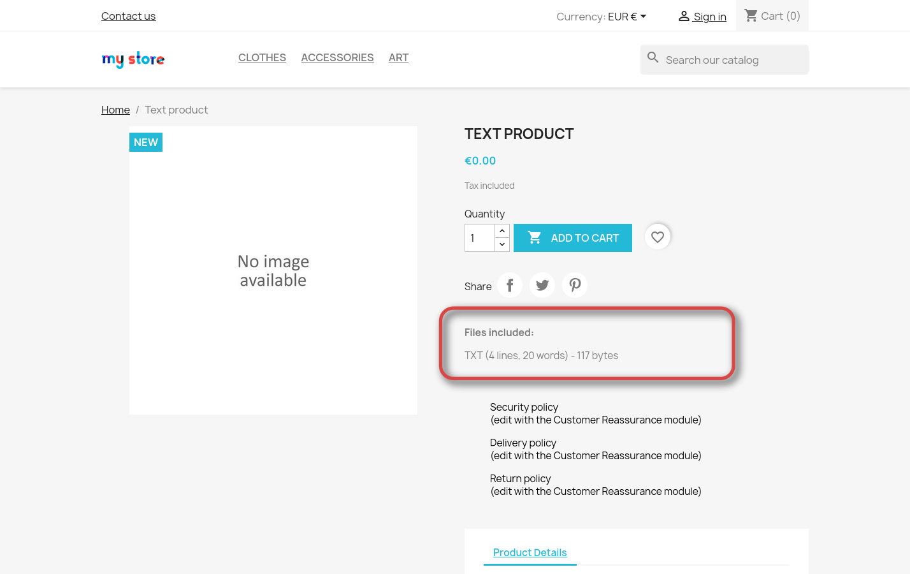
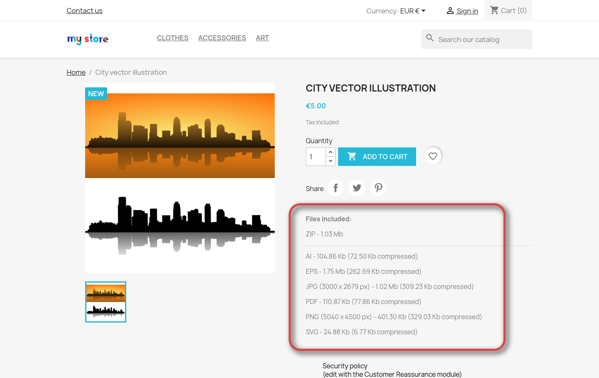

# Virtual Product Info

This Prestashop module intended for use for virtual products only. It shows downloadable file details on product page.

# Features

* Displays file extension and size
* For images (bmp, png, jpg, jpeg, gif extensions) displays dimension in pixels
* For text files (txt extension) displays line and word count
* For zip archives also displays:
  * information about every file in archive
  * compressed and uncompressed size
  
# Screenshots

# Requirements

* Prestashop 8.X or newer

# Download

From [release page](https://github.com/artem78/prestashop-virtualproductinfo/releases)

# Installation

In your Prestashop admin panel open "Module manager". Press "Upload a module" button. Choose zip archive with this module.

# Notes

Zip files unpacked to temporary directory each time when product page shown. This will take additional free space on disk. Also this operation may be slow with big archives.

# Author / contacts

Demin Artem (artem78)

Any question or problem? Email to [megabyte1024@ya.ru](mailto:megabyte1024@ya.ru?subject=prestashop-virtualproductinfo) or [create issue](https://github.com/artem78/prestashop-virtualproductinfo/issues) on GitHub.
