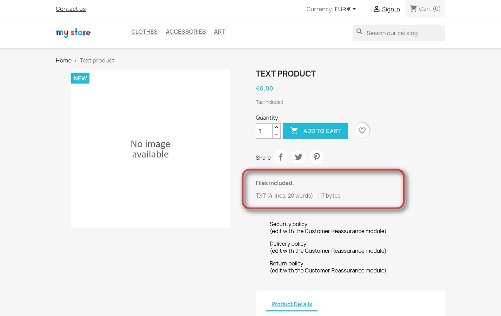

# Virtual Product Info

This Prestashop module intended for use for virtual products only. It shows information about downloadable file on product page.

# Features

* Displays file extension and size
* For images (bmp, png, jpg, jpeg, gif extensions) displays dimension in pixels
* For text files (txt extension) displays line and word count
* For zip archives also displays:
  * information about every file in archive
  * compressed and uncompressed size
  
# Screenshots

# Requirements

* Prestashop 8.X or newer

# Installation

In your Prestashop admin panel open "Module manager". Press "Upload a module" button. Choose zip archive with this module. After install go to module settings and enter your registration key.

# Purchase license

You can try this module for **free** within **7 days**. After trial period ended you should purchase license and enter registration key.

Go to product page: https://artem91.selly.store/product/d606cba4

# Notes

Zip files unpacked to temporary directory each time when product page shown. This will take additional free space on disk. Also this operation may be slow with big archives.

# Author / contact

Demin Artem (artem78)

Any question or problem? Email to megabyte1024@yandex.com
